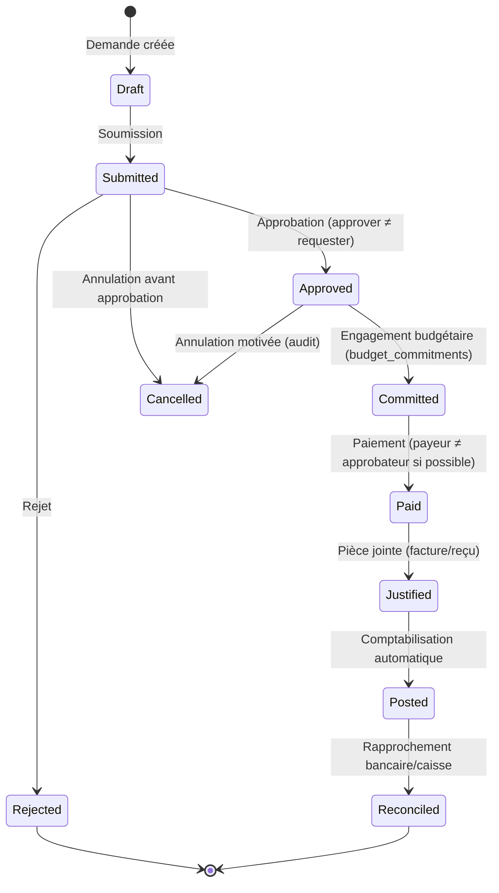
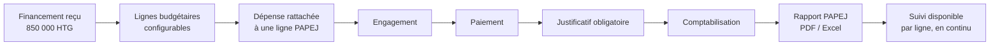
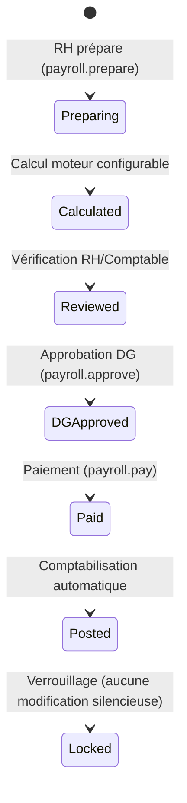
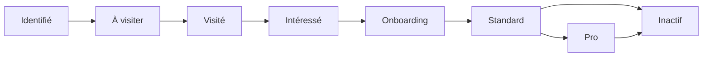

# MedFinder Gestion — Conception comptable & workflows métier

Statut : Phase 0 — Proposition en attente de validation.

## 1. Principes comptables

- Partie double stricte : toute écriture (`journal_entries` +
  `journal_entry_lines`) doit vérifier `SUM(debit) = SUM(credit)` avant de
  passer au statut `posted`. Contrainte appliquée par trigger Postgres, pas
  seulement par validation applicative.
- États d'une écriture : `draft → posted → (reversed)`. Aucune suppression.
  Une correction crée une **nouvelle** écriture de contre-passation
  (`reversed_entry_id`), jamais une modification de l'écriture d'origine.
- Périodes comptables : `accounting_periods.status ∈ {open, closed}`. Toute
  tentative d'écriture sur une période fermée est bloquée en RLS ; une
  procédure exceptionnelle (réouverture) exige `accounting.close_period` +
  validation DG + entrée d'audit explicite.
- Plan comptable configurable par organisation (`chart_of_accounts`), pas figé
  dans le code — permet l'ajout d'une seconde entité juridique sans migration.
- Multi-devise : chaque ligne d'écriture porte sa devise et son
  `exchange_rate_to_htg` **au moment de la saisie** ; aucun recalcul rétroactif
  lors d'un changement de taux ultérieur (§77 du prompt maître).

## 2. Journaux comptables (Phase 1)

`BANK`, `CASH`, `SALES`, `PURCHASES`, `PAYROLL`, `MISC` (opérations diverses),
extensible par organisation.

## 3. Automatisation comptable — table de correspondance (exemples de référence)

| Événement métier | Débit | Crédit |
|---|---|---|
| Abonnement Pro encaissé (MonCash) | Mobile Money (trésorerie) | Revenus abonnements |
| Achat ordinateur (immobilisation, payé banque) | Immobilisation informatique | Banque |
| Dépense terrain payée en caisse | Compte de charge (catégorie) | Caisse |
| Réception don affecté (banque) | Banque | Fonds affecté (ou Produits, selon `accounting_treatment_rules`) |
| Décaissement mensualité FDI | Charges financières (intérêts) + Emprunt FDI (principal) | Banque |
| Paie validée et payée | Charges de personnel | Banque / Mobile Money |
| Facture client émise (non encore encaissée) | Créances clients | Revenus |

Cette table est une référence de conception ; le mapping réel est stocké dans
`accounting_treatment_rules` / configuration par catégorie de dépense et par
type de contribution, configurable par le comptable — jamais hardcodé de façon
permanente pour les dons/subventions (§8 du module Dons, exigence explicite).
Aucune écriture déséquilibrée n'est permise à l'insertion (voir §1).

## 4. Workflow — Dépenses



Règles : impossibilité de créer directement une dépense au statut `Paid` (le
prompt maître l'interdit explicitement, §21) ; `budget_line` doit avoir un
disponible suffisant à l'étape `Committed` (sinon blocage ou validation
renforcée selon seuil `approval_thresholds`) ; justificatif obligatoire avant
`Posted`.

## 5. Workflow — PAPEJ



Disponible par ligne = `planned_amount − engaged_amount − paid_amount (non
engagé)`, recalculé en continu (vue SQL), visible en temps réel côté dashboard
DG. Une dépense sans justificatif reste visible et signalée (alerte), jamais
masquée.

## 6. Workflow — Dons & Subventions

```mermaid
flowchart LR
    A[Promesse / notification] --> B[Validation]
    B --> C[Réception]
    C --> D{Affecté ?}
    D -- Oui --> E[Budget dédié\ncontribution_budget_lines]
    D -- Non --> F[Utilisation générale\nsous contrôle interne]
    E --> G[Utilisation]
    F --> G
    G --> H[Justification]
    H --> I[Rapport bailleur]
    I --> J[Clôture]
    J --> K[Historique conservé\n(jamais supprimé)]
```

Une contribution affectée hors de son objet déclaré exige une validation
renforcée explicite (`donation.approve` + commentaire obligatoire), jamais un
blocage silencieux sans trace. Le solde à zéro ne fait jamais disparaître
l'historique, les documents, ni les affectations (§15 du module Dons).

## 7. Workflow — Comptabilité (cycle mensuel)

```mermaid
flowchart TB
    A[Écritures automatiques\n(dépenses, ventes, paie, actifs)] --> B[Écritures manuelles\n(opérations diverses)]
    B --> C[Revue comptable]
    C --> D[Rapprochement bancaire]
    D --> E[Contrôle équilibre\nBalance générale]
    E --> F[Clôture de période\n(accounting.close_period)]
    F --> G[États financiers\nJournal général / Grand livre / Balance / Résultat / Bilan]
```

Une période fermée ne peut plus recevoir d'écriture ; toute anomalie détectée
après clôture se corrige par contre-passation sur la période courante, jamais
par réouverture silencieuse.

## 8. Workflow — Payroll



Le moteur de calcul (`salary_components.calculation_rule`, jsonb) est
configurable — aucune retenue fiscale/sociale haïtienne n'est codée en dur
dans l'application (§39 du prompt maître). Une paie `Locked` ne peut être
corrigée que par une nouvelle écriture/avenant tracé, jamais par édition directe.

## 9. Workflow — CRM terrain



Chaque visite capture agent, prospect, date/heure, résultat, démonstration,
inscription, documents/photos, prochaine action. GPS optionnel par visite,
jamais de tracking permanent de l'agent (§43). Une commission n'est générée
qu'après encaissement effectif du paiement lié (`commission_rules.condition =
payment_collected_only`), jamais sur un abonnement seulement signé.

## 10. États financiers prévus (Phase 2)

Journal général, grand livre, balance générale, compte de résultat, bilan, flux
de trésorerie, balance auxiliaire clients, balance auxiliaire fournisseurs —
tous générés à partir des `journal_entries` postées, jamais saisis
indépendamment.

## 11. Numérotation automatique (référence, table `numbering_sequences`)

| Entité | Format |
|---|---|
| Employé | `EMP-0001` |
| Dépense | `DEP-2026-0001` |
| Facture | `MFH-INV-2026-0001` |
| Paiement | `PAY-2026-0001` |
| Écriture | `JE-2026-0001` |
| Immobilisation | `AST-0001` |
| Prospect CRM | `CRM-0001` |

Réinitialisation annuelle configurable par entité (`reset_rule`).
