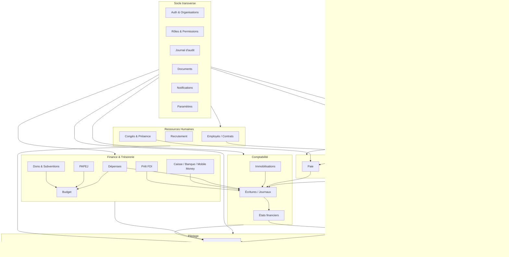

# MedFinder Gestion — Architecture générale

Statut : **Phase 0 — Proposition en attente de validation**
Périmètre : conception uniquement, aucun code métier n'a été écrit.

---

## 1. Résumé exécutif

MedFinder Gestion est une application interne de gestion d'entreprise (type ERP)
pour MedFinder Haiti, indépendante de la plateforme publique `medfinderhaiti.com`.
Elle couvre RH, finance, comptabilité, trésorerie, PAPEJ, prêt FDI, dons/subventions,
CRM terrain, payroll, immobilisations, documents et reporting, avec RBAC + permissions
granulaires, Row Level Security (RLS) systématique, et un journal d'audit central
inviolable depuis l'interface standard.

Le projet est conçu multi-organisation dès le départ (`organization_id` sur tout objet
métier), même si une seule organisation (« MedFinder Haiti ») est active en Phase 1.

## 2. Principes directeurs (non négociables)

- Aucune donnée financière fictive traitée comme réelle ; seed de démo strictement
  séparé (voir `docs/roadmap.md` §Seed).
- Aucune règle métier critique reposant uniquement sur TypeScript : contraintes SQL
  (FK, CHECK, UNIQUE, NOT NULL) + transactions pour toute invariance financière.
- Aucune suppression physique de données financières : annulation / contre-passation /
  clôture uniquement (soft delete généralisé pour les objets métier).
- `service_role` Supabase : serveur uniquement, jamais exposé, jamais loggé.
- RLS activé sur **toutes** les tables exposées, sans exception, dès leur création.
- Une phase n'est « terminée » que selon les 15 critères du prompt maître §8
  (schéma + migrations + RLS testé + APIs sécurisées + UI fonctionnelle + workflows
  testés + tests verts + aucun secret exposé + build/typecheck/lint verts, etc.).

## 3. Stack technique et justification

| Choix | Justification |
|---|---|
| Next.js (App Router) + TypeScript strict | SSR/RSC pour données sensibles rendues côté serveur, Server Actions pour mutations validées côté serveur, écosystème mature, déploiement Vercel natif. |
| Supabase (PostgreSQL managé + Auth + Storage) | PostgreSQL réel (contraintes fortes, transactions, RLS natif), Auth intégré avec MFA, Storage privé avec URLs signées, un seul fournisseur à opérer pour une petite équipe. |
| Row Level Security (Postgres) | Sécurité au niveau donnée, indépendante des bugs applicatifs — cohérent avec l'exigence « ne jamais désactiver RLS ». |
| Tailwind CSS | Vélocité UI, design system cohérent (bleu marine / vert émeraude), mobile-first pour agents terrain. |
| PWA (ciblé, pas systématique) | Utilisation terrain hors-ligne partielle (CRM/visites) en Phase 4, pas nécessaire Phase 1. |
| Vercel (hébergement) | Intégration native Next.js, previews par PR, variables d'env séparées par environnement. |

Aucune technologie supplémentaire (ORM lourd, queue externe, second SGBD, framework
UI tiers) n'est introduite sans justification écrite dans un ADR (voir §8).

**ORM/accès DB — décision à valider (voir docs/roadmap.md, Décision D1) :**
Option recommandée : requêtes typées via le client Supabase généré (`supabase gen
types typescript`) + fonctions Postgres (RPC) pour les opérations transactionnelles
critiques (comptabilisation, payroll, engagement budgétaire). Pas de Prisma/Drizzle
en Phase 1 pour éviter une double source de vérité sur le schéma ; réévaluable en
Phase 2 si la complexité des requêtes le justifie.

## 4. Architecture applicative

```
Client (navigateur / mobile web)
        │  HTTPS
        ▼
Next.js App Router (Vercel)
  ├─ Route Groups par domaine : (direction) (rh) (finance) (compta) (crm) (parametres)
  ├─ Server Components : lecture (dashboards, listes, rapports)
  ├─ Server Actions / Route Handlers : écritures (toujours revalidation permission + org)
  └─ Middleware : résolution session + organisation active + garde de route par permission
        │  (clé anon, jamais service_role)
        ▼
Supabase
  ├─ Auth (JWT, MFA rôles sensibles)
  ├─ PostgreSQL (schéma métier + RLS + fonctions RPC transactionnelles)
  ├─ Storage (buckets privés, URLs signées à durée limitée)
  └─ Triggers (audit_logs, contre-passation, verrouillage période/paie)
```

Règle de sécurité centrale : **toute permission est revérifiée côté serveur** au
moment de l'action (Server Action / Route Handler), jamais seulement au rendu du
menu. Le frontend n'est jamais une source d'autorité.

## 5. Structure du dépôt (proposée)

```
medfinder-gestion/
├─ app/
│  ├─ (auth)/                     # login, reset password, MFA
│  ├─ (app)/
│  │  ├─ direction/                # Module 1 — dashboard DG
│  │  ├─ rh/                       # employés, contrats, congés, présence, recrutement
│  │  ├─ finance/
│  │  │  ├─ depenses/
│  │  │  ├─ tresorerie/            # caisses, banques, mobile money
│  │  │  ├─ budget/
│  │  │  ├─ papej/
│  │  │  ├─ dons-subventions/
│  │  │  └─ fdi/
│  │  ├─ comptabilite/             # plan comptable, journaux, écritures, états
│  │  ├─ ventes/                   # clients, facturation, abonnements
│  │  ├─ fournisseurs/
│  │  ├─ immobilisations/
│  │  ├─ payroll/
│  │  ├─ crm/                      # prospects, visites, objectifs, commissions
│  │  ├─ documents/
│  │  ├─ rapports/
│  │  ├─ audit/
│  │  └─ parametres/
│  └─ api/                         # webhooks / intégration Phase 5 uniquement
├─ components/
│  ├─ ui/                          # primitives design system
│  └─ modules/                     # composants spécifiques par domaine
├─ lib/
│  ├─ supabase/                    # clients (server/browser), typegen
│  ├─ auth/                        # résolution session, permission guard
│  ├─ permissions/                 # constantes de permissions + helpers serveur
│  ├─ accounting/                  # règles de comptabilisation automatique
│  └─ validation/                  # schémas Zod par entité
├─ supabase/
│  ├─ migrations/                  # SQL versionné, une migration = un changement
│  ├─ seed/                        # seed DEV uniquement, jamais exécuté en prod
│  └─ policies/                    # RLS organisées par domaine (référence, appliquées via migrations)
├─ tests/
│  ├─ unit/
│  ├─ integration/                 # API + RLS
│  └─ e2e/                         # workflows critiques (Playwright)
├─ docs/
│  ├─ architecture.md
│  ├─ security.md
│  ├─ accounting-design.md
│  ├─ permissions-matrix.md
│  ├─ roadmap.md
│  ├─ data-model.md                # extension justifiée — voir §8 ADR-002
│  └─ adr/                         # décisions d'architecture datées
└─ .env.example                    # jamais de vraie clé committée
```

## 6. Architecture multi-organisation

- Table `organizations` = racine de toute donnée métier.
- Table `memberships` (user_id, organization_id, role_id, statut) = appartenance +
  rôle par organisation (un utilisateur peut appartenir à plusieurs organisations
  à terme, avec des rôles différents).
- **Toute** table métier porte `organization_id NOT NULL REFERENCES organizations(id)`.
- Session : l'utilisateur choisit une « organisation active » (contexte), stockée
  côté serveur (cookie signé / claim JWT custom), jamais côté client seul.
- RLS : chaque policy filtre systématiquement sur
  `organization_id = current_org_id()` **et** vérifie la permission requise
  (voir `docs/security.md` §RLS).
- Séquences de numérotation (`numbering_sequences`), plan comptable, catégories,
  seuils d'approbation : configurables **par organisation**, pas globaux, pour
  permettre l'ajout d'une seconde entité juridique sans migration de données.

## 7. Diagramme des modules



## 8. Décisions d'architecture (ADR — résumé)

| ID | Décision | Statut |
|---|---|---|
| ADR-001 | Application ERP indépendante (`medfinder-gestion`), aucune intégration forte au code public MedFinder Haiti ; connexion future via API contrôlée uniquement (Phase 5). | Proposé |
| ADR-002 | Le modèle de données complet est documenté dans `docs/data-model.md` (fichier séparé de `architecture.md`) car il dépasse 55 tables — extension au périmètre strict des 5 livrables demandés, justifiée par la lisibilité. | Proposé |
| ADR-003 | Accès DB via client Supabase typé + fonctions RPC transactionnelles pour les opérations comptables/payroll critiques ; pas d'ORM tiers en Phase 1. | Proposé — nécessite validation (Décision D1) |
| ADR-004 | RBAC à deux niveaux : rôle (regroupement par défaut) + permissions granulaires assignables individuellement (`role_permissions` + `user_permission_overrides`), tout est vérifié côté serveur et en RLS. | Proposé |
| ADR-005 | Comptabilité en partie double stricte avec contrainte SQL (trigger) refusant toute écriture où `SUM(debit) != SUM(credit)`. | Proposé |
| ADR-006 | Multi-devise (HTG/USD) : chaque transaction fige son taux de conversion au moment de la saisie (`exchange_rate_at_posting`), jamais de recalcul rétroactif. | Proposé |
| ADR-007 | Soft delete / annulation pour tout objet financier ; suppression physique interdite hors RGPD-like demandes explicites sur données personnelles non financières. | Proposé |

## 9. Intégration future avec MedFinder Public (Phase 5 — principes uniquement)

- Aucun accès direct à la base interne depuis la plateforme publique, dans aucun sens.
- Un service d'API dédié (clé API scoped, rate-limited, endpoints en lecture/écriture
  minimale : prestataires, statut abonnement, statistiques agrégées) sera conçu en
  Phase 5 avec sa propre revue de sécurité. Non détaillé davantage en Phase 0.

## 10. Environnements

| Environnement | Base Supabase | Usage |
|---|---|---|
| dev (local/preview) | Projet Supabase dédié « dev », seed de démo autorisé | Développement, review PR |
| staging | Projet Supabase dédié « staging », données de test réalistes non fictives-financières | Validation avant prod, tests E2E |
| production | Projet Supabase dédié « prod », aucune donnée de démo | Utilisation réelle par MedFinder Haiti |

Variables d'environnement séparées par environnement dans Vercel ; `.env.example`
documente les clés requises sans valeurs réelles.
