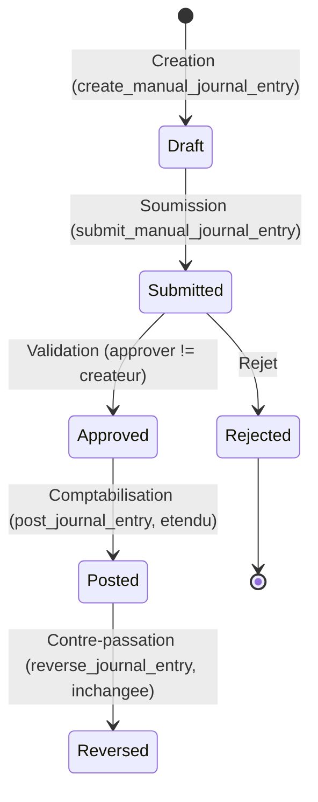

# Phase 2 — Finance & Comptabilité complète — Plan proposé

Statut : **PLAN VALIDÉ PAR JEAN ALIX PIERRE LE 17/08/2026, sous réserve
des 6 décisions ci-dessous — toutes intégrées dans ce document avant le
premier commit de code** (même discipline que `docs/phase-1c-plan.md`).
**Phase 2A est autorisée à démarrer** (§4/§12) ; 2B et les suivantes
restent non commencées tant que 2A n'est pas close avec preuve.

## 0. Décisions actées (17/08/2026)

Six décisions tranchées par Jean Alix Pierre, intégrées dans le plan
ci-dessous (détail par sous-phase concernée) :

1. **Dons & Subventions → Phase 2-bis séparée**, pas dans le cœur
   Phase 2 : contributions, affectations, fonds restreints, dépenses
   rattachées, dons en nature, documents, reporting bailleur,
   intégration comptable — vertical slice à part entière, plan et
   clôture propres. Les permissions déjà seedées (`donation.*`,
   `grant.*`, `restricted_fund.manage`) **restent dormantes** — accordées
   en catalogue depuis la Phase 1A mais sans aucune table/RPC/UI tant
   que Phase 2-bis n'est pas construite et testée.
2. **`expense_requests.supplier_id` reste nullable en permanence** —
   pas de bascule obligatoire. `payee_name`/`payee_reference` demeurent
   le fallback pour dépenses historiques, bénéficiaires ponctuels, et
   toute dépense antérieure au référentiel Fournisseurs. Quand un
   fournisseur est sélectionné, `payee_name`/`payee_reference` sont
   **snapshotés** depuis la fiche fournisseur au moment de la saisie
   (jamais recalculés rétroactivement si la fiche change ensuite — même
   principe que `exchange_rate_to_htg` figé à la saisie, ADR-006). Aucune
   donnée Phase 1C existante n'est modifiée par cette extension.
3. **Écritures manuelles : séparation saisie/validation obligatoire**,
   workflow `Draft → Submitted → Approved/Rejected → Posted → Reversed`.
   Le créateur ne peut jamais valider sa propre écriture par défaut ;
   exception SoD uniquement via le mécanisme déjà prouvé en Phase 1C
   (justification + validation DIRECTEUR_GENERAL/SUPER_ADMIN + audit) —
   détail complet en §Sous-phase 2A ci-dessous.
4. **Import bancaire (2D) : CSV UTF-8 configurable d'abord**, mapping de
   colonnes (date, libellé, référence, débit, crédit ou montant signé,
   devise, solde optionnel), profils d'import sauvegardés par compte
   bancaire. **Aucun format propriétaire haïtien (Sogebank/Unibank/BUH/
   BNC) hardcodé.** OFX/CAMT/API bancaire différés à une phase
   ultérieure si le besoin se confirme.
5. **Plan comptable : seed minimal MedFinder + entièrement
   administrable**, ni vide ni surdimensionné — liste proposée en §5A.
   Le comptable peut créer/désactiver des comptes et définir les
   mappings métier. **Aucun compte ayant servi à une écriture ne peut
   être supprimé physiquement** (déjà partiellement vrai — `DELETE`
   déjà révoqué à `authenticated` depuis 1C.1 — renforcé en 2A par un
   trigger défense-en-profondeur, voir 2A).
6. **Ordre de priorité confirmé et rendu séquentiel (pas parallèle)** :
   2A → 2B → 2C → 2D → 2E → 2F. Facturer/encaisser d'abord (2C), puis
   rapprocher la banque (2D), puis actifs (2E), puis prêt FDI (2F) dont
   les conditions contractuelles définitives restent non figées
   (`is_provisional`, risque déjà identifié en Phase 0).

**Vérification explicite demandée — aucune sous-phase ne recrée un
objet déjà livré en Phase 1C** : confirmé par l'inventaire §1 (moteur
comptable, permissions, numérotation tous réutilisés tels quels) et la
table de vérification §12 ci-dessous, croisant chaque sous-phase avec
les objets Phase 1C qu'elle réutilise sans les dupliquer.

CRM (Phase 4) et Payroll (Phase 3) restent hors périmètre — ni dans la
demande initiale, ni dans le contenu roadmap de Phase 2.

## 1. Ce qui existe déjà (audité aujourd'hui contre le SQL réel — rien de ceci n'est à reconstruire)

| Élément | État réel (Phase 1C) |
|---|---|
| `chart_of_accounts` | Table complète (code, label, type, hiérarchie via `parent_account_id`, `is_active`), RLS `accounting.view`/`accounting.post`. **Aucune UI de gestion dédiée** — seulement un formulaire minimal noyé dans `/tresorerie` (`app/(app)/tresorerie/page.tsx`, `app/actions/treasury.ts`). |
| `fiscal_years` / `accounting_periods` | Exercices + périodes mensuelles, `status open/closed`, **immutabilité d'une période fermée garantie par trigger** (`app_private.accounting_periods_immutable_once_closed`), y compris contre `service_role`. Pas de vraie UI de clôture (juste `accounting.close_period` en RLS). |
| `journals` | 6 journaux standards auto-seedés à la création d'organisation (`BANK`,`CASH`,`SALES`,`PURCHASES`,`PAYROLL`,`MISC`), extensible. |
| `journal_entries` / `journal_entry_lines` | Partie double stricte (`SUM(debit)=SUM(credit)` vérifié atomiquement au posting, pas ligne par ligne), `draft → posted`, **immutabilité post-`posted` garantie par trigger** (même via `service_role`), `cost_center_id` déjà câblé (ajouté en 1C.3). **`source_type` CHECK inclut déjà `'invoice'`, `'payroll'`, `'asset'`, `'loan'`, `'contribution'`, `'manual'`** en plus de `'expense'`/`'grant'` — anticipé dès 1C.1, **aucune migration de schéma requise sur cette colonne pour Phase 2**. |
| `post_journal_entry` (RPC publique) | Poste un brouillon déjà existant (permission `accounting.post`). Réutilisable tel quel pour les écritures manuelles. |
| `reverse_journal_entry` (RPC publique) | Contre-passation, nouvelle écriture, original intact (permission `accounting.reverse`). **Déjà générique** — fonctionne pour n'importe quelle écriture postée, quel que soit `source_type`. Réutilisable tel quel. |
| `app_private.create_and_post_two_line_entry` | Interne (jamais exposée à `authenticated`), crée + poste une écriture **à exactement 2 lignes**. Utilisée aujourd'hui automatiquement par `justify_expense_request` (comptabilisation dépense) et `record_grant_receipt` (réception PAPEJ). |
| `cash_accounts`/`bank_accounts`/`mobile_money_accounts`/`cash_movements` | Trésorerie complète, `cash_movements.reconciled boolean` **existe déjà dans le schéma mais reste toujours `false`** (jamais mis à jour — aucun workflow de rapprochement n'existe). `journal_entry_id` déjà lié. |
| Permissions | Catalogue **déjà seedé en Phase 1A** pour la quasi-totalité du périmètre Phase 2 (`accounting.*`, `treasury.reconcile`, `invoice.manage`, `payment.record`, `customer.manage`, `supplier.manage`, `asset.manage`/`asset.view`, `loan.manage`/`loan.view`), **déjà accordées aux rôles pertinents** (SUPER_ADMIN, DIRECTEUR_GENERAL, COMPTABLE, DIRECTEUR_TECHNIQUE pour `asset.*`). Détail exact en §5. |
| Numérotation | `numbering_sequences` (moteur générique) déjà utilisé pour `journal_entry` (`JE-{year}-{seq:04d}`) ; formats déjà définis dans `docs/accounting-design.md` §11 pour `invoice` (`MFH-INV-{year}-{seq:04d}`), `payment` (`PAY-{year}-{seq:04d}`), `asset` (`AST-{seq:04d}`) — juste à enregistrer, moteur inchangé. |

**Conséquence directe** : Phase 2 n'est pas un nouveau socle, c'est une
**extension** d'un moteur comptable déjà testé (65 tests d'intégration
1C.1-1C.5) et déjà production-proven sur deux workflows réels (dépenses,
PAPEJ). Le risque architectural principal n'est pas "est-ce que la
partie double tient" (déjà prouvé), mais "comment brancher proprement
les nouveaux domaines (tiers, immobilisations, prêt) sur ce moteur sans
dupliquer sa logique".

## 2. Ce qui manque complètement (aucune table, aucune RPC, aucune UI)

- **Écritures manuelles** : aucune RPC publique ne crée un brouillon
  d'écriture. `create_and_post_two_line_entry` est interne et limitée à
  2 lignes — insuffisant pour une écriture manuelle multi-lignes réelle
  (ex. répartition d'une charge sur 3 comptes).
- **États financiers** : 0 vue/rapport. Grand livre, journal général,
  balance générale, compte de résultat, bilan, flux de trésorerie —
  aucun n'existe, ni comme vue SQL ni comme page UI.
- **Tiers** : 0 table `customers`/`suppliers`. Les dépenses utilisent
  aujourd'hui `payee_name`/`payee_reference` en texte libre (déviation
  documentée du plan 1C, §6 du rapport de clôture 1C).
- **Facturation** : 0 table `invoices`/`invoice_lines`/`credit_notes`/
  `payments`.
- **Immobilisations** : 0 table `assets`/`asset_assignments`/
  `asset_depreciation_schedules`.
- **Prêt FDI** : 0 table `loans`/`loan_schedules`/`loan_payments`.
- **Rapprochement bancaire réel** : 0 table `bank_reconciliations`/
  `bank_reconciliation_lines`, aucune UI de lettrage. Le champ
  `cash_movements.reconciled` existe mais n'est câblé nulle part.
- **Navigation/UI** : aucune section `/comptabilite` dans l'app
  aujourd'hui (`lib/navigation.ts`) — le plan comptable et les journaux
  ne sont visibles qu'en creux, via Trésorerie.

## 3. Ce qui doit être étendu (pas recréé)

- **`expense_requests`** : ajouter `supplier_id uuid references
  suppliers(id)` **nullable en permanence** (décision actée §0.2), en
  plus de `payee_name`/`payee_reference` existants (jamais supprimés,
  jamais rendus obligatoires — rétrocompatibilité totale avec
  l'historique 1C). Quand `supplier_id` est renseigné, `payee_name`/
  `payee_reference` sont copiés (snapshot, pas une référence live) depuis
  la fiche fournisseur au moment de la saisie.
- **`app_private.create_and_post_two_line_entry`** reste utilisée telle
  quelle pour tout cas à 2 lignes (paiement fournisseur simple,
  amortissement mensuel d'un actif). **Nouvelle fonction
  `app_private.create_and_post_multi_line_entry`** (N lignes,
  `debit=credit` vérifié par le même `post_journal_entry` déjà
  existant — aucune duplication de l'invariant) pour les écritures
  manuelles et les factures multi-lignes.
- **`cash_movements`** : aucune colonne ajoutée. `bank_reconciliation_lines`
  référence `cash_movements` depuis elle-même (FK sortante), jamais
  l'inverse.
- **`journal_entries.source_type`** : déjà prêt (§1), aucune migration.

## 4. Découpage recommandé en sous-phases

Ordre proposé = ordre de dépendance réelle (chaque sous-phase ne
s'appuie que sur ce qui la précède) :

**Ordre séquentiel confirmé (décision §0.6)** : 2A → 2B → 2C → 2D → 2E →
2F, une sous-phase à la fois, chacune close avec preuve avant la
suivante — **2B et les suivantes ne démarrent pas en parallèle de 2A**.
Facturer/encaisser d'abord (2C) maximise la valeur opérationnelle
immédiate ; rapprocher la banque ensuite (2D) ; puis les actifs (2E) ;
le prêt FDI en dernier (2F) car ses conditions contractuelles
définitives ne sont pas encore connues (`is_provisional`, risque déjà
identifié en Phase 0 — aucune urgence à le construire avant les autres).

---

### 2A — Moteur comptable complet (fondation)

**Objectif** : rendre le moteur existant utilisable directement par le
COMPTABLE (plan comptable, journaux, exercices/périodes, écritures
manuelles **avec séparation saisie/validation obligatoire**), sans
rien changer au *comportement* de ce qui fonctionne déjà (Dépenses/
PAPEJ continuent de poster automatiquement, immédiatement, exactement
comme aujourd'hui — seule leur trajectoire interne dans
`post_journal_entry` est légèrement élargie, voir "Modification d'une
fonction existante" ci-dessous, avec régression explicitement testée).

**Workflow écritures manuelles (décision §0.3)** :

Règle centrale, non contournable par défaut : **le créateur d'une
écriture manuelle ne peut pas l'approuver lui-même** — même mécanisme
exact que la séparation des fonctions déjà prouvée sur les dépenses
(`approve_expense_request` refuse `approver = requester`). Exception
formelle disponible (même patron que
`request_expense_approval_exception`/`validate_expense_approval_exception`) :
justification obligatoire + validation exclusive
DIRECTEUR_GENERAL/SUPER_ADMIN + entrée d'audit explicite, jamais un
contournement silencieux.

**Tables** :
- **Nouvelle** : `journal_entry_approvals` — mirror exact de
  `expense_approvals` (1C.4), même colonnes/sémantique :
  `entry_id`, `approver_id`, `decision` (`approved`/`rejected`),
  `decided_at`, `comment`, `sod_rule_violated` (bool),
  `exception_justification`, `exception_requested_by`,
  `exception_validated_by`, `exception_validated_at`,
  `exception_result`. Réutilise le patron déjà audité, pas une
  nouvelle conception.
- **Modifiée** : `journal_entries.status` CHECK élargi de
  `('draft','posted')` à `('draft','submitted','approved','rejected','posted')`.
  **Uniquement pertinent pour `source_type = 'manual'`** — les entrées
  automatiques (`expense`, `grant`) continuent d'aller directement
  `draft → posted` dans la même transaction, comme aujourd'hui,
  inchangé.

**Modification d'une fonction existante (à isoler et tester
spécifiquement pour la régression)** : `app_private.post_journal_entry`
accepte aujourd'hui uniquement `status = 'draft'`. Élargi pour accepter
`status IN ('draft', 'approved')` — `'draft'` reste le chemin emprunté
par les entrées automatiques (inchangé, testé en non-régression),
`'approved'` est le nouveau chemin emprunté uniquement par une écriture
manuelle qui vient de recevoir sa validation SoD. Aucun autre
comportement de la fonction ne change (invariants équilibre/période/
comptes toujours vérifiés à l'identique).

**RPC nouvelles** :
- `app_private.create_and_post_multi_line_entry(...)` — interne, N
  lignes, réutilise la validation déjà existante dans
  `app_private.post_journal_entry` (aucune duplication de l'invariant
  partie double).
- `public.create_manual_journal_entry(p_org_id, p_journal_code,
  p_entry_date, p_description, p_lines jsonb)` → crée un **brouillon**
  (`status='draft'`, `source_type='manual'`). Permission
  `accounting.post` (existante, aucune nouvelle permission catalogue).
- `public.submit_manual_journal_entry(p_entry_id)` → `draft→submitted`.
- `public.approve_manual_journal_entry(p_entry_id, p_comment)` /
  `public.reject_manual_journal_entry(p_entry_id, p_comment)` →
  `submitted→approved/rejected`. **Refuse explicitement si
  `auth.uid() = journal_entries.created_by`** (SoD, même garde que
  `approve_expense_request`). Permission `accounting.post` (même
  permission que la création — la séparation est appliquée par la
  vérification d'acteur dans la RPC, pas par une permission différente,
  cohérent avec le patron dépenses où `expense.approve` seul suffit
  déjà à couvrir la garde SoD).
- `public.request_manual_entry_approval_exception(p_entry_id,
  p_justification)` / `public.validate_manual_entry_approval_exception(...)`
  — mirror exact des RPC dépenses homonymes, validateur
  DIRECTEUR_GENERAL/SUPER_ADMIN obligatoire.
- `public.post_journal_entry` (existante) — élargie comme décrit
  ci-dessus, réutilisée sans nouvelle RPC.
- Server Actions simples (pas de nouvelle RPC `SECURITY DEFINER`) pour
  le CRUD `chart_of_accounts`/`journals`/`fiscal_years`/
  `accounting_periods` — même patron que `departments`/`positions` en
  Phase 1B, RLS déjà en place (`accounting.post`/`accounting.view`).
  Clôture de période : policy `accounting_periods_close` déjà existante
  (transition `open→closed` uniquement), juste une UI à construire.

**Défense en profondeur — comptes utilisés jamais supprimables (décision
§0.5)** : nouveau trigger `chart_of_accounts_immutable_if_used`
(`before delete`), même patron exact que
`accounting_periods_immutable_once_closed`/
`journal_entries_immutable_once_posted` — refuse toute suppression d'un
compte référencé par au moins une ligne `journal_entry_lines`, y
compris via `service_role`. `DELETE` reste par ailleurs déjà révoqué à
`authenticated` depuis 1C.1 (double garantie, comme pour les périodes).
Seule la désactivation (`is_active=false`) reste possible pour un compte
utilisé.

**Permissions** : 100% déjà seedées (`accounting.post/reverse/
close_period/view`). **Aucune nouvelle permission catalogue** — la
séparation saisie/validation est appliquée par vérification d'acteur
dans les RPC (comme les dépenses), pas par une permission dédiée à
l'approbation.

**RLS** : `journal_entry_approvals` suit le patron `expense_approvals`
(select gardé par `accounting.view`, écriture exclusivement via les RPC
`SECURITY DEFINER` ci-dessus). Aucun changement de policy sur les
tables existantes.

**UI** : nouvelle section `/comptabilite` — plan comptable (liste +
création + désactivation, jamais de suppression), journaux (liste +
création), exercices/périodes (liste + clôture avec confirmation
explicite), écritures (liste filtrable par journal/période/statut,
détail avec lignes ET historique d'approbation, bouton "Nouvelle
écriture manuelle" avec formulaire multi-lignes équilibré en temps réel
côté client + validation serveur faisant foi, bouton "Soumettre",
bouton "Approuver"/"Rejeter" — **masqué pour le créateur de l'écriture**
même s'il détient `accounting.post`, exactement comme le bouton
"Approuver" d'une dépense reste visible mais renvoie un refus explicite
côté backend si cliqué par le demandeur (cohérence UX avec le patron
1C.4) —, bouton "Comptabiliser" réutilisant `post_journal_entry`
élargie, bouton "Contre-passer" réutilisant `reverse_journal_entry`
inchangée).

**Tests** : création écriture manuelle équilibrée/déséquilibrée
(refus) ; écriture < 2 lignes (refus) ; auto-approbation refusée
(créateur = approbateur) ; exception SoD (justification + validation DG
uniquement) ; période fermée bloque toute nouvelle écriture ou tout
posting ; suppression d'un compte utilisé refusée même via
`service_role` (nouveau trigger) ; isolation multi-organisation ;
permission `accounting.post` requise sur chaque étape ; **régression
complète des workflows Dépenses/PAPEJ existants sur `post_journal_entry`
élargie** (non négociable — seuls consommateurs actuels du moteur,
177 tests d'intégration existants rejoués sans aucune modification
attendue de leur résultat).

**Migrations** (noms indicatifs) :
`20260818090001_manual_journal_entries.sql`,
`20260818090002_chart_of_accounts_seed_and_immutability.sql`.

---

### 2B — États financiers (lecture seule)

**Plan détaillé séparé : voir `docs/phase-2b-plan.md`** (rédigé le
17/08/2026, après clôture de 2A, incluant l'exigence supplémentaire de
Jean Alix Pierre : réconciliation inter-états testée automatiquement).
Le résumé ci-dessous est conservé pour l'historique mais **une décision
de conception y a été corrigée** : `v_cash_flow` n'est **plus** sourcée
depuis `cash_movements` — cela violerait l'exigence explicite "les
chiffres doivent être dérivés exclusivement des écritures comptables
postées, jamais directement des modules métier". Le flux de trésorerie
est désormais dérivé de `journal_entry_lines` filtrées aux comptes de
trésorerie (identifiés via `cash_accounts`/`bank_accounts`/
`mobile_money_accounts.gl_account_id`, pas par code compte codé en dur)
— voir `docs/phase-2b-plan.md` §3 pour le détail complet.

**Objectif** : générer les 6 états financiers listés, **exclusivement à
partir de `journal_entries`/`journal_entry_lines` déjà postées** —
jamais une saisie indépendante (cohérent avec `accounting-design.md`
§10).

**Permissions** : `accounting.view` (déjà seedée, déjà accordée).
Aucune nouvelle.

**Tests** : exactitude arithmétique de chaque état contre des écritures
de test connues, isolation multi-org, **et réconciliation inter-états
testée automatiquement** (balance générale ↔ grand livre ↔ journal
général ↔ compte de résultat ↔ bilan, Actif = Passif + Capitaux
Propres + Résultat non clôturé) — détail complet en
`docs/phase-2b-plan.md`.

---

### 2C — Tiers & Facturation

**Objectif** : clients, fournisseurs, factures/avoirs, paiements —
avec écritures automatiques via le moteur 2A (facture émise → créance
client ; paiement reçu/émis → lettrage créance/dette).

**Tables nouvelles** (reprises de `docs/data-model.md` §J, inchangées) :
`customers`, `suppliers`, `invoices`, `invoice_lines`, `credit_notes`,
`payments`.

**RPC** : `create_invoice` (brouillon), `send_invoice` (poste l'écriture
créance via `create_and_post_multi_line_entry`), `record_payment`
(lettre un paiement à une facture, poste l'écriture trésorerie via le
moteur 2A, mouvement de trésorerie lié comme aujourd'hui pour les
dépenses), `create_credit_note` (avoir, contre-passation partielle liée
à la facture).

**Permissions** : `customer.manage`, `supplier.manage`,
`invoice.manage`, `payment.record` — **toutes déjà seedées et déjà
accordées** à SUPER_ADMIN/DIRECTEUR_GENERAL/COMPTABLE (§5). Aucune
nouvelle permission catalogue nécessaire.

**RLS** : patron standard `organization_id` + permission, identique à
`expense_requests`.

**Workflow facture** : `draft → sent → partially_paid → paid` (ou
`cancelled` avant `sent`), avoir toujours lié à une facture `sent+`.

**"Créances"/"dettes fournisseurs"** : pas de nouvelle table — vues
dérivées (`v_customer_balances`/`v_supplier_balances`, factures moins
paiements par tiers), cohérent avec le principe "jamais une saisie
indépendante".

**Intégration Dépenses** : `expense_requests.supplier_id` (§3, décision
§0.2) — nullable en permanence, snapshot `payee_name`/`payee_reference`
à la sélection, aucune dépense existante ni futur mode de saisie
"ponctuel" cassé.

**Migrations** : `20260819090001_customers_suppliers.sql`,
`20260819090002_invoicing.sql`.

---

### 2D — Rapprochement bancaire réel

**Tables nouvelles** : `bank_reconciliations`, `bank_reconciliation_lines`,
`bank_import_profiles` (décision §0.4 — profils d'import sauvegardés par
compte bancaire : `bank_account_id`, `label`, `column_mapping` jsonb
`{date, description, reference, debit, credit, signed_amount, currency,
balance}` — chaque champ pointe vers l'index/l'en-tête de colonne CSV
réel de la banque concernée, aucun champ obligatoire au-delà de
date/montant, `signed_amount` xor `debit`+`credit` selon la convention
du relevé), `bank_import_batches` (traçabilité d'un import : fichier,
profil utilisé, nombre de lignes, date, importé par).

**RPC** : `import_bank_statement_csv(bank_account_id, profile_id,
csv_content)` — parse **CSV UTF-8 uniquement** (décision §0.4, pas
OFX/CAMT/API en 2D) selon le mapping du profil, crée les lignes
`bank_reconciliation_lines` en attente de rapprochement, jamais de
`cash_movement` créé automatiquement (le relevé est une source externe
à confronter, pas une source de vérité qui écrirait dans la
comptabilité) ; `start_bank_reconciliation(bank_account_id,
period_start, period_end)` ; `match_reconciliation_line(reconciliation_id,
cash_movement_id, statement_line_ref)` (met `cash_movements.reconciled
= true`) ; `close_bank_reconciliation` (exige `difference_amount = 0`
sur toutes les lignes, sinon refus explicite).

**Permission** : `treasury.reconcile` — **déjà seedée, déjà accordée**
à SUPER_ADMIN/COMPTABLE. Aucune nouvelle — couvre aussi la gestion des
profils d'import (pas de permission `bank_import.manage` séparée).

**Format d'import (décision §0.4)** : CSV UTF-8 avec mapping de colonnes
configurable par profil (date, libellé, référence, débit/crédit ou
montant signé, devise, solde optionnel) — **aucun format propriétaire
haïtien (Sogebank/Unibank/BUH/BNC) hardcodé**. OFX/CAMT/API bancaire
explicitement différés, non traités en 2D.

**Migrations** : `20260820090001_bank_reconciliation.sql`.

---

### 2E — Immobilisations

**Tables nouvelles** : `assets`, `asset_assignments`,
`asset_depreciation_schedules`.

**RPC** : `create_asset` (écriture d'acquisition automatique via le
moteur 2A, 2 lignes), `run_monthly_depreciation` (génère les écritures
d'amortissement du mois pour tous les actifs actifs d'une période —
job idempotent, rejouable sans double-comptabilisation), `assign_asset`/
`return_asset` (suivi d'affectation, pas de comptabilisation).

**Permissions** : `asset.manage` (SUPER_ADMIN/DIRECTEUR_GENERAL/
DIRECTEUR_TECHNIQUE — **note RBAC déjà actée** : COMPTABLE n'a que
`asset.view`, pas `asset.manage` — le suivi physique reste DT/DG, la
comptabilisation reste `accounting.post`), `asset.view` (+ COMPTABLE).
**Toutes déjà seedées.**

**Migrations** : `20260821090001_fixed_assets.sql`.

---

### 2F — Prêt FDI

**Tables nouvelles** : `loans`, `loan_schedules`, `loan_payments`.

**RPC** : `create_loan` (`is_provisional=true` par défaut tant que les
conditions réelles ne sont pas signées, cohérent avec le risque
roadmap déjà identifié), `generate_loan_schedule` (tableau
d'amortissement, méthode `constant_installment`/`constant_principal`),
`record_loan_payment` (écriture charges financières + principal via le
moteur 2A).

**Permissions** : `loan.manage`/`loan.view` — **déjà seedées, déjà
accordées** à SUPER_ADMIN/DIRECTEUR_GENERAL/COMPTABLE.

**Migrations** : `20260822090001_fdi_loan.sql`.

---

## 5. Permissions — synthèse (aucune nouvelle permission catalogue requise)

| Code | Déjà seedé | Déjà accordé à | Sous-phase |
|---|---|---|---|
| `accounting.post/reverse/close_period/view` | ✅ (1A) | SUPER_ADMIN, DIRECTEUR_GENERAL (view/close_period seulement — pas post/reverse), COMPTABLE | 2A, 2B |
| `treasury.reconcile` | ✅ (1A) | SUPER_ADMIN, COMPTABLE | 2D |
| `customer.manage` | ✅ (1A) | SUPER_ADMIN, DIRECTEUR_GENERAL, COMPTABLE | 2C |
| `supplier.manage` | ✅ (1A) | SUPER_ADMIN, COMPTABLE | 2C |
| `invoice.manage` | ✅ (1A) | SUPER_ADMIN, COMPTABLE | 2C |
| `payment.record` | ✅ (1A) | SUPER_ADMIN, COMPTABLE | 2C |
| `asset.manage` | ✅ (1A) | SUPER_ADMIN, DIRECTEUR_GENERAL, DIRECTEUR_TECHNIQUE | 2E |
| `asset.view` | ✅ (1A) | + COMPTABLE | 2E |
| `loan.manage`/`loan.view` | ✅ (1A) | SUPER_ADMIN, DIRECTEUR_GENERAL, COMPTABLE | 2F |

**Aucune ligne à ajouter à `insert into public.permissions`.** Seule
vérification requise en 2A-2F : confirmer par test que chaque
`role_permissions` déjà en place produit le comportement attendu une
fois les RLS/RPC réellement écrites (le catalogue existe, mais n'a
jamais été exercé par du vrai code — **à ne pas supposer sans test**,
même s'il est déjà seedé).

## 5A. Plan comptable — seed proposé (décision §0.5)

Seed minimal, immédiatement utilisable pour MedFinder, appliqué à la
création d'organisation (même mécanisme que `seed_default_journals` en
1C.1) — **entièrement administrable ensuite** (le comptable crée/
désactive librement, ce seed n'est qu'un point de départ, pas un
catalogue figé) :

| Code | Libellé | Type | Domaine couvert |
|---|---|---|---|
| 1000 | Caisse | asset | Trésorerie (déjà utilisé implicitement par 1C, jamais nommé formellement) |
| 1010 | Banque | asset | Trésorerie |
| 1020 | Mobile Money | asset | Trésorerie |
| 1100 | Créances clients | asset | 2C |
| 1500 | Immobilisations — matériel informatique | asset | 2E |
| 1510 | Immobilisations — matériel de bureau | asset | 2E |
| 1590 | Amortissements cumulés | asset | 2E (contra-actif) |
| 2100 | Dettes fournisseurs | liability | 2C |
| 2200 | Emprunt FDI | liability | 2F |
| 2900 | Fonds affectés (dons/subventions) | liability | Dormant — Phase 2-bis |
| 3000 | Capital / Apport fondateurs | equity | Bilan (nécessaire à l'équilibre, §2B) |
| 3900 | Résultat de l'exercice | equity | Bilan/compte de résultat |
| 4000 | Revenus — abonnements | revenue | Facturation (2C) |
| 4010 | Revenus — publicité/sponsoring | revenue | Facturation (2C) |
| 4900 | Revenus PAPEJ (déjà utilisé par `record_grant_receipt`) | revenue | 1C, déjà en usage réel |
| 6000 | Charges — dépenses opérationnelles (regroupe `expense_categories`) | expense | 1C, déjà en usage réel |
| 6100 | Charges — paie | expense | Hors Phase 2 (Phase 3), compte réservé |
| 6200 | Charges financières — intérêts FDI | expense | 2F |
| 6800 | Dotations aux amortissements | expense | 2E |

**~18 comptes**, pas les 100+ d'un plan SYSCOHADA complet ni un plan
vide. Les comptes déjà réellement utilisés par 1C (revenus PAPEJ,
charges dépenses) sont formalisés plutôt que recréés en double — à
vérifier lors de l'implémentation 2A contre les comptes que
`justify_expense_request`/`record_grant_receipt` référencent
aujourd'hui en pratique (créés au cas par cas par le comptable jusqu'ici,
pas encore standardisés).

## 6. RLS — patron réutilisé (aucune nouvelle stratégie)

Identique à 1A-1C, sans exception : `organization_id` sur chaque table,
policy `using/with_check` = `is_super_admin(auth.uid()) OR
has_permission(auth.uid(), organization_id, '<code>')`, écriture
comptable exclusivement via RPC `SECURITY DEFINER` (jamais de
`INSERT`/`UPDATE` direct sur `journal_entries`/`journal_entry_lines`
pour `authenticated` — déjà le cas, reste inchangé), `(select
auth.uid())` dès l'écriture des nouvelles policies (pas de nouveau
`auth_rls_initplan` à corriger après coup — leçon Phase 1C directement
appliquée).

## 7. Plan de tests (même discipline que Phase 1C — pas un allégement)

- **Hermétisme des fixtures dès le premier test** : `FixtureRegistry`
  (`tests/support/fixture-registry.ts`) utilisé dès 2A, pas en
  rattrapage — leçon explicite de Phase 1C.
- **Par sous-phase** : RLS positive/négative par rôle, invariants
  transactionnels (équilibre débit/crédit pour toute nouvelle RPC de
  comptabilisation, immutabilité post-posted déjà couverte
  génériquement), isolation multi-organisation, régression des
  workflows Dépenses/PAPEJ existants après 2A (non-négociable).
- **E2E Playwright** : un parcours critique par sous-phase (facture
  émise → payée → lettrée ; actif créé → amortissement mensuel généré ;
  écriture manuelle créée → comptabilisée → contre-passée ;
  rapprochement bancaire clôturé).
- **Rejeu complet en une seule passe continue avant toute clôture de
  sous-phase** — critère déjà appliqué en clôture Phase 1C, reconduit
  ici dès le départ plutôt qu'en rattrapage final.

## 8. Risques

| Risque | Impact | Mitigation proposée |
|---|---|---|
| `create_and_post_multi_line_entry` dupliquerait la logique de validation si mal conçue | Deux points de vérité pour l'invariant partie double | Réutiliser `app_private.post_journal_entry` tel quel (déjà générique sur le nombre de lignes) — ne jamais dupliquer la vérification `debit=credit` |
| Élargissement de `post_journal_entry` (draft+approved) casse Dépenses/PAPEJ | Régression sur les deux seuls workflows financiers en production | Non-régression testée explicitement (177 tests d'intégration existants rejoués sans changement de résultat attendu, §2A) |
| `supplier_id` sur `expense_requests` mal séquencé avec 2C | Dépenses créées entre 2A et 2C sans lien fournisseur propre | `supplier_id` nullable en permanence (décision §0.2), rétrocompatible par construction |
| Profils d'import CSV mal mappés | Lignes de relevé mal interprétées (débit/crédit inversés, devise ignorée) | `import_bank_statement_csv` ne crée jamais de `cash_movement` directement — seulement des lignes en attente de rapprochement manuel, aucune écriture comptable automatique depuis un CSV importé |
| Amortissement mensuel non idempotent | Double comptabilisation si le job est relancé | `run_monthly_depreciation` doit vérifier l'absence d'écriture déjà postée pour `(asset_id, period_id)` avant toute insertion — invariant à tester explicitement |
| Dette Phase 1C non réglée avant Phase 2 (§10) | Dette qui s'accumule sur un périmètre plus large | §10 — décision à prendre sur le calendrier de résorption |
| Portée large (6 sous-phases) | Dérive de portée si tout est livré en un seul commit | Un commit atomique par sous-phase, clôture individuelle avec preuve, comme 1C.1-1C.5 |

## 9. Critères de clôture (par sous-phase, puis globaux — 15 critères §8 roadmap, inchangés)

Chaque sous-phase (2A-2F) n'est déclarée close que si, **avec preuve
vérifiable, pas par affirmation** : schéma + migrations appliquées ;
RLS testée (positif/négatif, tous rôles concernés) ; permissions
testées ; RPC sécurisées (audit `SECURITY DEFINER` même discipline que
§20.2 du rapport 1C) ; UI fonctionnelle ; workflow(s) fonctionnel(s)
bout en bout ; tests verts en **une seule passe continue** ; aucun
secret exposé ; données de test isolées (`FixtureRegistry` dès le
départ) ; typecheck/lint/build verts ; aucune régression connue sur
Dépenses/Budget/PAPEJ/Trésorerie. Phase 2 globale close seulement quand
2A-2F sont toutes closes individuellement (Dons & Subventions traité à
part en Phase 2-bis, §0.1 — pas comptée dans la clôture de Phase 2).

## 10. Dette Phase 1 à régler avant/pendant Phase 2

| Dette (source) | Régler avant Phase 2 ? |
|---|---|
| `grant_expenses` allocation multi-lignes non construit (§6 rapport 1C) | Non bloquant — indépendant du périmètre Phase 2, à revisiter séparément si le besoin émerge |
| `payer_is_approver` non testé en pratique (rapport 1C) | Recommandé pendant 2A (une session AAL2 sera de toute façon nécessaire pour tester les nouvelles permissions `accounting.*` en profondeur) |
| Sweep accessibilité restant (rapport 1C §15/§23) | Non bloquant, à faire en continu sur les nouveaux formulaires 2A-2F dès leur création (éviter d'accumuler à nouveau) |
| Docker local non confirmé (rapport 1C §11) | Recommandé avant 2A — un périmètre aussi large mérite un environnement de dev local fiable, pas uniquement le cloud partagé |

## 11. Décisions actées le 17/08/2026 (anciennement "questions ouvertes")

Les 6 questions posées dans la version précédente de ce document sont
**toutes tranchées** par Jean Alix Pierre — détail et intégration dans
le plan ci-dessus, résumé ici pour mémoire :

1. **Dons & Subventions → Phase 2-bis séparée** (§0.1). Permissions déjà
   seedées, laissées dormantes.
2. **`expense_requests.supplier_id` nullable en permanence**, coexistence
   durable avec `payee_name`/`payee_reference`, snapshot à la sélection
   (§0.2, §3).
3. **Écritures manuelles : séparation saisie/validation obligatoire**,
   workflow `Draft → Submitted → Approved/Rejected → Posted → Reversed`,
   exception SoD via justification + validation DG (§0.3, détail complet
   en 2A).
4. **Rapprochement bancaire : CSV UTF-8 configurable**, profils d'import
   par compte bancaire, aucun format propriétaire haïtien hardcodé,
   OFX/CAMT/API différés (§0.4, détail complet en 2D).
5. **Plan comptable : seed minimal MedFinder (~18 comptes) + entièrement
   administrable**, jamais vide ni surdimensionné, aucun compte utilisé
   supprimable même via `service_role` (§0.5, §5A).
6. **Ordre séquentiel confirmé** : 2A → 2B → 2C → 2D → 2E → 2F, une
   sous-phase à la fois, aucune en parallèle (§0.6, §4).

## 12. Vérification — aucune sous-phase ne recrée un objet Phase 1C

| Sous-phase | Objets Phase 1C réutilisés tels quels | Nouveaux objets Phase 2 |
|---|---|---|
| 2A | `chart_of_accounts`, `fiscal_years`, `accounting_periods`, `journals`, `journal_entries`/`journal_entry_lines` (schéma existant, CHECK élargi seulement), `post_journal_entry` (élargi, pas remplacé), `reverse_journal_entry` (inchangée), `create_and_post_two_line_entry` (inchangée, toujours utilisée par Dépenses/PAPEJ), moteur `numbering_sequences`, patron `expense_approvals`/SoD dépenses (répliqué, pas modifié) | `journal_entry_approvals`, `create_and_post_multi_line_entry`, RPC workflow manuel, trigger `chart_of_accounts_immutable_if_used` |
| 2B | `journal_entries`/`journal_entry_lines` postées (lecture seule), patron `budget_line_balances` (`security_invoker`) | 6 vues de rapport |
| 2C | Moteur 2A pour le posting, `expense_requests` étendue (pas recréée), numérotation déjà définie (`accounting-design.md` §11) | `customers`, `suppliers`, `invoices`, `invoice_lines`, `credit_notes`, `payments` |
| 2D | `cash_movements` (champ `reconciled` déjà présent, jamais recréé), `treasury.reconcile` déjà seedée | `bank_reconciliations`, `bank_reconciliation_lines`, `bank_import_profiles`, `bank_import_batches` |
| 2E | Moteur 2A pour le posting, `asset.manage`/`asset.view` déjà seedées | `assets`, `asset_assignments`, `asset_depreciation_schedules` |
| 2F | Moteur 2A pour le posting, `loan.manage`/`loan.view` déjà seedées | `loans`, `loan_schedules`, `loan_payments` |

Aucune ligne de ce tableau ne recrée un objet déjà livré — confirmé.

---

**Plan validé. Phase 2A est autorisée à démarrer** (§0, §12) — migrations,
RLS/RBAC, tests positifs/négatifs, tests SoD, tests immutabilité/
posting/contre-passation, typecheck, lint, build, puis rapport de
clôture 2A, puis arrêt pour validation avant 2B. **2B et les suivantes
ne démarrent pas en parallèle de 2A.**
